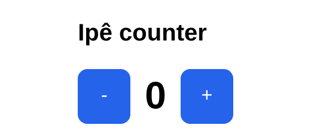
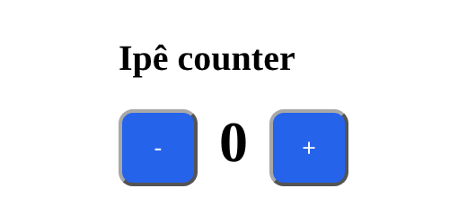

# `shapes` — the five app entry shapes

The code below is Ipê source, not shell. Every program has one `main`; the
**head of `main`** pins the shape — the compiler reads it, never a config field.
Five shapes exist:

| Shape | Entry | `view` renders | Scaffold |
|-------|-------|----------------|----------|
| **Web** *(default)* | `Web.tea` | Browser DOM (`Element`) — served SSR+SSE, or a `solo` wasm client | `ipe init app web` |
| **Tui** | `Tui.tea` | Full-screen terminal cells (`Screen`) | `ipe init app tui` |
| **Cli** | `Cli.tea` | Line-oriented terminal output (`Lines`) | `ipe init app cli` |
| **Worker** | `Worker.tea` | *nothing* — a view-less TEA loop | `ipe init app worker` |
| **Script** | bare `main : Task Error ()` (or `Server.listen`) | *nothing* — a plain effect | `ipe init app script` |

Web / Tui / Cli / Worker follow [The Elm Architecture](https://guide.elm-lang.org/architecture/):
`init` · `update` · `subscriptions`, plus a `view` for the three that render —
and nothing else. Input is an event like any other, so it arrives through
`subscriptions`: key presses via `Tui.Sub.onKey`, stdin lines via
`Cli.Sub.onLine`. Do not mix a `Cmd`/`Sub` from one shape into another — that
is **IPE-N0035** (`WrongShapeCmdSub`); `Tui` and `Cli` each own their `Sub`
(only the shared `Ipe.Tea.Terminal.Sub`, with no input subscription, serves
both).

## Web

Browser DOM app on the TEA loop. `init` receives a `WebReq`; `view` returns
`Element Msg`; `routes`/`notFound` carry URL routing (`[]` for a single page).
This is `ipe init`'s default.

```ipe
module Main exposing (main)

import Ipe.String as String
import Ipe.Tea.Web exposing (tea)
import Ipe.Tea.Web.Cmd as Cmd
import Ipe.Tea.Web.Sub as Sub
import Ipe.Ui as Ui
import Ipe.Ui.Font as Font


type Page
    = CounterPage


type Msg
    = Increment
    | Decrement


type alias Model =
    { count : Int }


init : WebReq -> ( Model, Cmd Msg )
init _req =
    ( { count = 0 }, Cmd.none )


update : Msg -> Model -> ( Model, Cmd Msg )
update msg model =
    case msg of
        Increment ->
            ( { model | count = model.count + 1 }, Cmd.none )

        Decrement ->
            ( { model | count = model.count - 1 }, Cmd.none )


subscriptions : Model -> Sub Msg
subscriptions _model =
    Sub.none


view : Model -> Element Msg
view model =
    Ui.row [ Ui.spacing 12 ]
        [ Ui.button [] { onPress = Just Decrement, label = Ui.text "-" }
        , Ui.el [ Font.bold ] (Ui.text (String.fromInt model.count))
        , Ui.button [] { onPress = Just Increment, label = Ui.text "+" }
        ]


main =
    tea
        { init = init
        , update = update
        , view = view
        , subscriptions = subscriptions
        , routes = []
        , notFound = CounterPage
        }
```

`Web.appRouted` and `Web.appWith` (a `List (Setting Web)` prefix) are the same
shape with URL routing / settings.

### Delivery: runtime × host

Web is the only shape with a **delivery** choice — two axes ([full
guide](../guide/delivery.md)):

- **runtime** — `served` (co-located SSR+SSE server; the unnamed default) or
  `solo` (self-contained WebAssembly client).
- **host** — where it runs: a browser tab, a `desktop` system-webview window, or
  an `ios` / `android` webview shell.

**Shape is not host:** desktop and mobile are the *same* `Web` app — same `main`,
same `view` — delivered differently, so every host shows the identical DOM. One
uniform grammar: `ipe <build|release> web <host>` (`desktop` implies `served`;
mobile is `web solo <os>`).

| runtime | host | command | rendered view |
|---------|------|---------|---------------|
| served | browser | `ipe run` |  |
| solo | browser | `ipe run` (wasm client) |  |
| served | desktop | `ipe release web desktop` | same served view, in a WebKitGTK window  |
| solo | ios | `ipe release web solo ios` | same solo view, in a `WKWebView`  |
| solo | android | `ipe release web solo android` | same solo view, in an Android `WebView`  |

The last three rows reuse the browser capture on purpose: **every host renders
the identical DOM** — desktop/iOS/Android only wrap it in a native shell — so the
pixels are the same. A native-frame capture needs the target platform (a display
for the desktop webview, an Xcode/Android simulator for mobile); see [Delivering
an app](../guide/delivery.md) for building, running, and simulating each host.

## Tui

Full-screen terminal UI; `view` returns `Screen Msg`. Key input is a
subscription: `Sub.onKey` (from `Ipe.Tea.Tui.Sub`) takes a handler that maps a
`{ kind : String, value : String }` key event to a `Msg`.

```ipe
subscriptions : Model -> Sub Msg
subscriptions _model =
    Sub.onKey onKey


main =
    Tui.tea
        { init = init
        , update = update
        , view = view
        , subscriptions = subscriptions
        }
```

Combine keys with other events through `Sub.batch` (e.g.
`Sub.batch [ Sub.onKey onKey, Sub.every 1000 Tick ]`); a key with no active
`onKey` subscription is ignored. Passing `onKey` as a `Tui.tea` config field is
**IPE-N0051**.

The scaffolded counter (`Up` +, `Down` -, `q` quit) renders as:

```
Ipê counter
 count = 0
(Up +, Down -, q quit)
```

## Cli

Line-oriented terminal app / REPL; `view` returns `Lines Msg`. Line input is a
subscription: `Sub.onLine` (from `Ipe.Tea.Cli.Sub`) takes a handler that maps
each stdin line to a `Msg`.

```ipe
subscriptions : Model -> Sub Msg
subscriptions _model =
    Sub.onLine onLine


main =
    Cli.tea
        { init = init
        , update = update
        , view = view
        , subscriptions = subscriptions
        }
```

A line with no active `onLine` subscription is ignored. Passing `onLine` as a
`Cli.tea` config field is **IPE-N0051**.

The scaffolded echo REPL (type text, `q` quits):

```
echoed 0 [] > hello
echoed 1 [hello] > q
```

## Worker

A view-less TEA loop — `init` / `update` / `subscriptions`, **no `view`**. For
background jobs, timers, and pipelines.

```ipe
main =
    Worker.tea
        { init = init
        , update = update
        , subscriptions = subscriptions
        }
```

## Script

No model, no loop — `main` is a `Task Error ()`, a description of effects. The
simplest shape; `Server.listen` (an HTTP server) is also a Script.

```ipe
module Main exposing (main)

import Ipe.Io as Io


main : Task Error ()
main =
    Io.println "Hello, world!"
```

## Choosing a shape

- Browser / desktop / mobile app? → **Web**
- Full-screen terminal UI? → **Tui**
- Line-oriented terminal app or REPL? → **Cli**
- Background loop, no UI? → **Worker**
- One-shot script, tool, or HTTP server? → **Script**

## Glossary

- **shape** — one of five `main` entry patterns: Web, Tui, Cli, Worker, Script.
- **`Web.tea`** — browser DOM TEA entry (`Element` view; `served` or `solo`).
- **`Tui.tea`** — full-screen terminal TUI entry (`Screen` view).
- **`Tui.Sub.onKey`** — the `Tui` key-input subscription
  (`(KeyEvent -> msg) -> Sub msg`).
- **`Cli.tea`** — line-oriented terminal entry (`Lines` view).
- **`Cli.Sub.onLine`** — the `Cli` line-input subscription
  (`(String -> msg) -> Sub msg`).
- **`Worker.tea`** — view-less TEA loop.
- **runtime / host** — Web-only delivery axes; see [Delivering an app](../guide/delivery.md).
